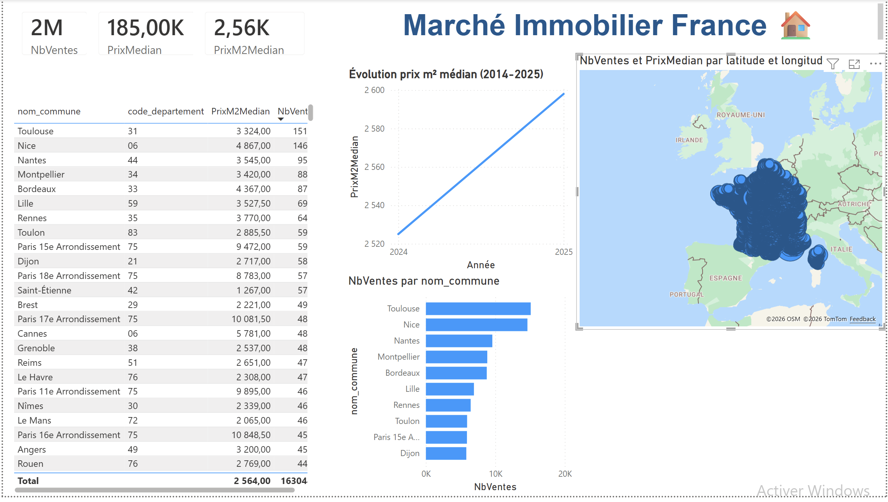
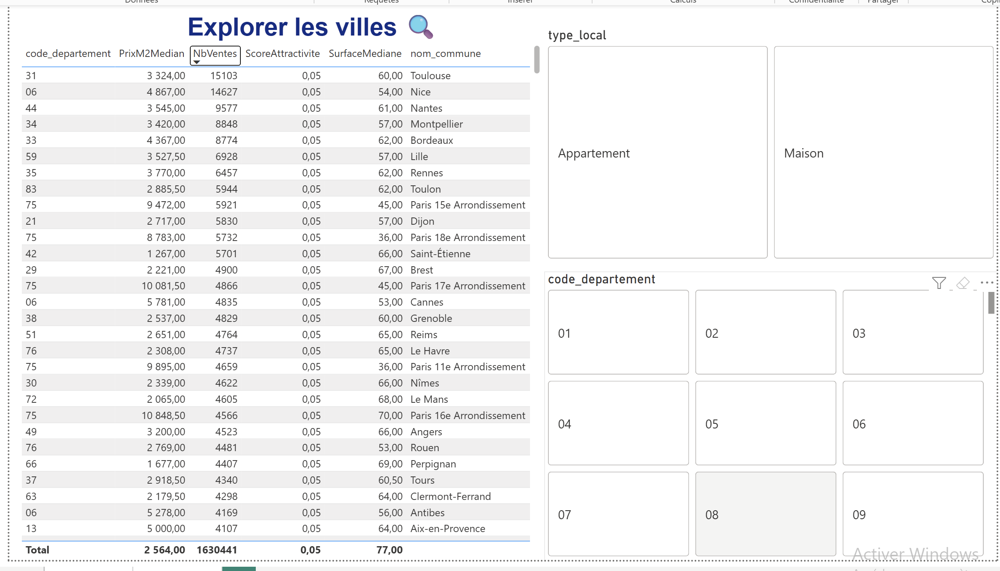

# Rental Radar FR 🏠

Un dashboard Power BI pour repérer les villes françaises où l'investissement locatif a encore du sens en 2026.

---

## Pourquoi j'ai fait ce projet

À la base, je voulais juste comprendre si acheter un studio à Saint-Étienne était vraiment une bonne idée comparé à un T2 à Reims. J'ai commencé à fouiller les données DVF un soir, et de fil en aiguille j'ai fini par construire un truc beaucoup plus large. Autant le partager.

L'idée n'est pas de remplacer un conseiller en gestion de patrimoine ni de promettre la rentabilité parfaite. C'est un outil d'aide à la décision : on rentre une enveloppe budgétaire, une stratégie, et on sort une liste de communes qui méritent qu'on aille y faire un tour le week-end.

Le contexte 2026 est particulier. Avec la loi Climat qui interdit déjà la location des G depuis janvier 2025 et qui va serrer la vis sur les F en 2028, beaucoup de "bonnes affaires" sur le papier sont en réalité des pièges. Le projet intègre ça directement dans le scoring.

## Captures d'écran

### Vue marché national


### Explorateur de villes


## Ce que fait l'outil concrètement

- Cartographie des prix au m² et des loyers de marché par commune
- Calcul de rendement brut, net, et net-net (après vacance + frais de gestion + taxe foncière)
- Score de tension locative à partir des données INSEE
- Comparateur de villes côte à côte
- Top 10 des villes les plus actives sur le marché

## Structure du projet

```
rental-radar-fr/
├── data/                    # Données sources (gitignorées) + échantillons
├── scripts/                 # ETL Python : download, clean, enrich
├── powerbi/                 # Modèle de données + mesures DAX + descriptif des visuels
├── docs/                    # Méthodologie, sources, glossaire
├── screenshots/             # Captures du dashboard
└── requirements.txt
```

## Stack technique

| Outil | Pour quoi faire |
|-------|----------------|
| Python 3.11 | ETL, nettoyage, enrichissement des données |
| Pandas / GeoPandas | Manipulation tabulaire et géospatiale |
| Power BI Desktop | Modélisation, DAX, dashboarding |
| DuckDB | Requêtes rapides sur les fichiers DVF |

## Installation et utilisation

```bash
git clone https://github.com/dogukanyener/rental-radar-fr.git
cd rental-radar-fr
python3 -m venv .venv
source .venv/bin/activate
pip install -r requirements.txt
```

Pour télécharger et préparer les données :

```bash
python scripts/download_dvf.py --year 2024 --year 2025
python scripts/clean_dvf.py
python scripts/enrich_with_insee.py
```

## Sources des données

- **DVF** (DGFiP, via data.gouv.fr) — toutes les ventes immobilières en France depuis 2014, mises à jour deux fois par an
- **DPE** (Ademe) — diagnostics énergétiques de plus de 14 millions de logements
- **INSEE** — données démographiques et socio-économiques au niveau communal
- **Cerema DVF+** — version géolocalisée et nettoyée de DVF

## Note technique — Power BI sur Mac

Je tourne sur un MacBook Air M4 avec macOS Tahoe, donc pas de version native de Power BI Desktop. J'ai résolu ça avec Parallels Desktop qui fait tourner Windows 11 ARM en parallèle. Concrètement ça change rien à l'utilisation — Power BI s'ouvre comme n'importe quelle appli, mes fichiers parquet générés côté Mac sont accessibles directement depuis Windows via le partage de dossiers Parallels.

C'est une contrainte que j'ai transformée en avantage : ça m'a forcé à vraiment séparer la partie data (Python côté Mac) de la partie visualisation (Power BI côté Windows), ce qui donne une architecture plus propre que si j'avais tout fait dans le même environnement.

Si tu es dans le même cas et que tu veux reproduire le projet sur Mac, les scripts Python tournent nativement sans aucun problème. Seul Power BI Desktop nécessite la VM Windows — ou une alternative comme Tableau Desktop qui est lui disponible nativement sur Apple Silicon.

## Limites assumées

- DVF n'inclut **pas** l'Alsace, la Moselle ni Mayotte
- Les données les plus récentes ont 6 mois de retard côté DVF
- Les loyers utilisés sont des estimations marché, pas des loyers réels signés

## Roadmap

- [ ] Intégration des taux Crédit Logement pour simuler le coût de financement
- [ ] Module "rénovation énergétique" : coût estimé pour passer un F en D
- [ ] Refresh automatisé via GitHub Actions une fois par mois

## Licence

MIT. Faites-en ce que vous voulez. Si ça vous a aidé à éviter un mauvais investissement ou à en trouver un bon, un petit message me ferait plaisir.
